# My Tic Tac Toe 
**Developer: Paul Pfister**

[Visit live website](https://paulunder.github.io/my_tic_tac_toe/)

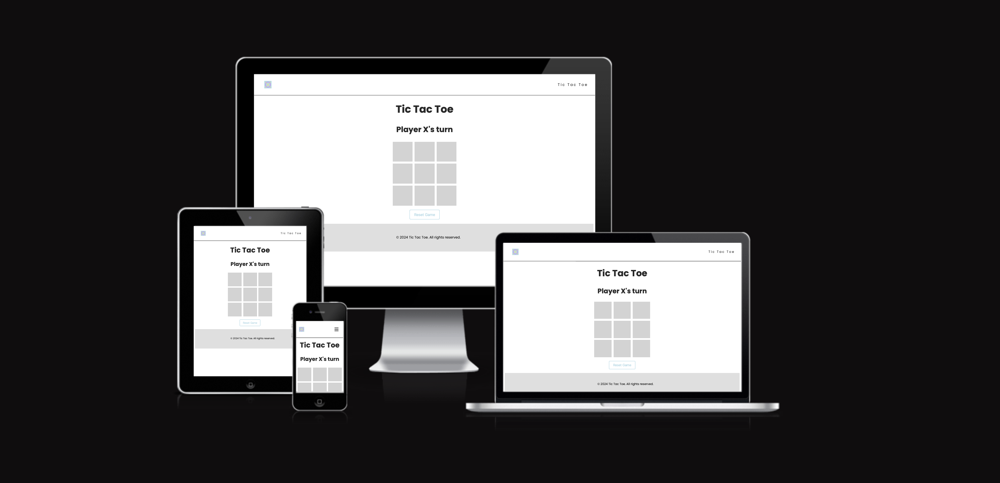

## Table of Content
  - [Project Goals](#project-goals)
    - [User Goals](#user-goals)
    - [Site Owner Goals](#site-owner-goals)
  - [User Experience](#user-experience)
    - [Target Audience](#target-audience)
    - [User Requirements and Expectations](#user-requirements-and-expectations)
  - [User Stories](#user-stories)
    - [Site User](#site-user)
    - [Site Owner](#site-owner)
  - [Design](#design)
    - [Colour Scheme](#colour-scheme)
    - [Fonts](#fonts)
    - [Structure](#structure)
    - [Wireframes](#wireframes)
  - [Technologies Used](#technologies-used)
    - [Languages](#languages)
    - [Frameworks, Libraries & Tools](#frameworks-libraries--tools)
  - [Features](#features)
  - [Validation](#validation)
    - [HTML Validation](#html-validation)
    - [CSS Validation](#css-validation)
    - [JavaScript Validation](#javascript-validation)
    - [Accessibility](#accessibility)
    - [Performance](#performance)
  - [Testing](#testing)
    - [Performing tests on various devices](#performing-tests-on-various-devices)
    - [Browser compatibility](#browser-compatibility)
    - [Testing user stories](#testing-user-stories)
  - [Bugs](#bugs)
  - [Deployment](#deployment)
  - [Credits](#credits)
  - [Acknowledgements](#acknowledgements)

## Project Goals

The goal of this project was to achieve a suprise by playing tic tac toe - a well known game but with confetti.

### User Goals

- Just play a game of tic tac toe - a well known game
- simple multiplayer game with a friend

### Site Owner Goals

- create a game that enhances people to play with each other
- Create visually appealing design
- Create a simple navigation around website
- Provide fully responsive and accessible website

## User Experience

### Target Audience

- The game can be played by two players that are looking for a simple and fun game to play
- Anyone who wants to have fun playing a game with a friend or family member

### User Requirements and Expectations

- Well known game - easy to understand
- Simple navigation
- Simple presentation of content on the page that makes logical sense
- A responsive website that allows two friends to play the game on the same device
- Links and functions that work as expected
- Accessibility

## User Stories

### Site User

1. I want to easily understand the rules of the game
2. I want to play a game with my friend
3. I want to use the game on my mobile, tablet and desktop
4. I want to be able to make a win with my friend
5. I want to be able to see who has won
6. I want to be able to see who's turn it is
7. I want to be able to see the result of the game
8. I want to contact the developer if I have any questions
9. I want to easily navigate throught the site

### Site Owner

8. I want users to easily understand the game
9. I want the users to challenge each other
10. I want my game to be fully responsive
11. I want the user to come to a 404 error page instead of having to use the browser back button if they enter a url that does not exist
12. I want that the user can contact me if they have any questions or feature requests

## Design

### Colour Scheme

The color scheme is very simple and based on the game colors. The main colors used are:
- `#ADD8E6` - low contrast color
- `#D3D3D3` - background color
- `#00003C` - high contrast color

The pallet used was found on [Coloors.co](https://coolors.co/)
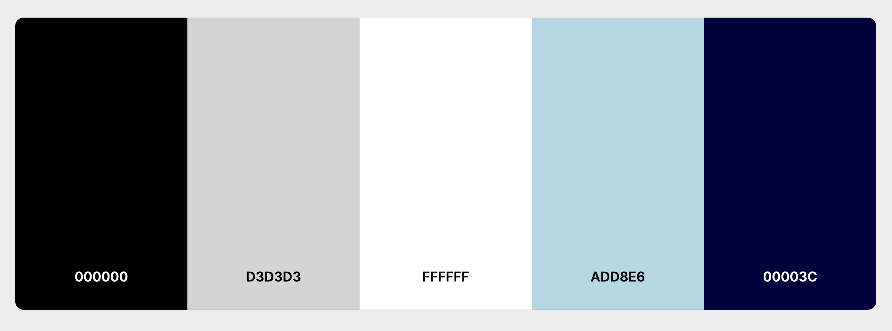

### Fonts

I implemented Google Fonts into the website. The font used is 'Poppins', sans-serif. The font was chosen for its readability and simplicity. Also much more important the look fr the letters X and O was impacting the choice of the font.

### Structure

The structure of the website was designed to be very simple and easy accessible. You have directly the game on the main page and you can start playing immediately. 

- The game consist of the following screens:
- Main game screen / Home Page - there you can play Tic tac Toe
- A separate 404 error page

### Wireframes

Main Page

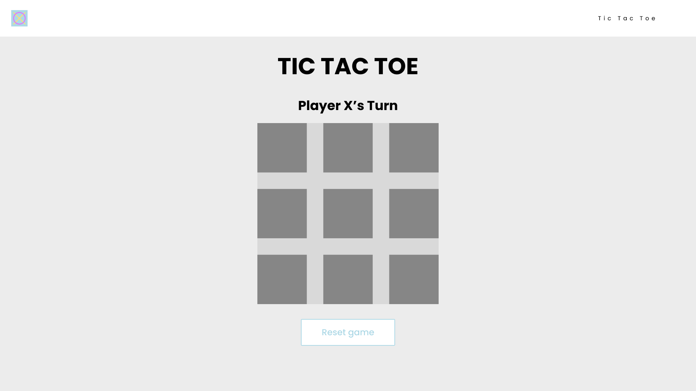

404 page

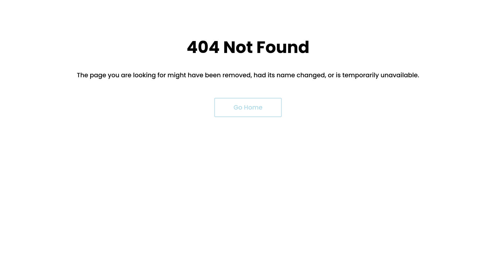

## Technologies Used

### Languages

- HTML
- CSS
- JavaScript

### Frameworks, Libraries & Tools

- [Am I Responsive](http://ami.responsivedesign.is/) was used to create the multi-device mock-up you can see at the start of this README.md file.
- [figma](https://figma.com/) to create the wireframes for the project
- [Favicon.io](https://favicon.io) for making the site favicon
- [Font Awesome](https://fontawesome.com/) - Icons from Font Awesome were used throughout the site
- [Affinity Designer](https://affinity.serif.com/designer/) Affinity Designer - for creating the logo
- [Git](https://git-scm.com/) was used for version control within VSCode to push the code to GitHub
- [GitHub](https://github.com/) was used as a remote repository to store project code
- [Google Fonts](https://fonts.google.com/)
- [Confetti JavaScript](https://www.cssscript.com/confetti-falling-animation/) - for the confetti effect
- [Confetti library Import](https://cdn.jsdelivr.net/npm/canvas-confetti@1.0.1) - extra import of another confetti library
- [Chrome dev tools](https://developers.google.com/web/tools/chrome-devtools) were used for debugging of the code and check site for responsiveness
- [WC3 Validator](https://validator.w3.org/), [Jigsaw W3 Validator](https://jigsaw.w3.org/css-validator/), [Wave Validator](https://wave.webaim.org/), [Lighthouse](https://developers.google.com/web/tools/lighthouse/) and [Am I Responsive](http://ami.responsivedesign.is/) were all used to validate the website

## Features

The website has 3 webpages consisting of 11 distinct features described below.

### Home screen

### Game screen
- The below elements are displayed on the screen:
  - Player X and O
  - Game board
  - Button to restart the game
  - Confetti elements
  - disply which winning combination won
- User stories covered: 2, 3, 4, 5, 6, 7

See feature

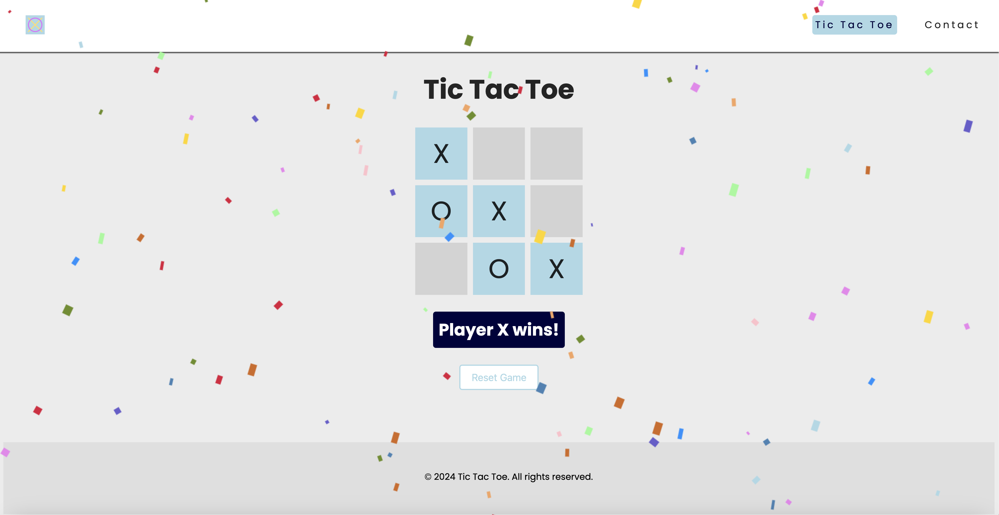

### Contact Form
- User is able to provide feedback about the game
- User stories covered: 8, 12

See feature

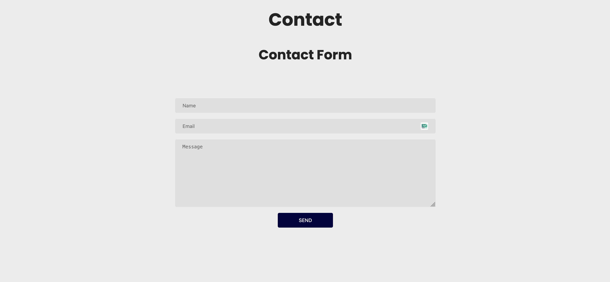

### 404 error page
- The site has been given a 404 error page which is displayed if the user enters a url that does not exist.
- Contains return to the main screen button
- User stories covered: 9

See feature

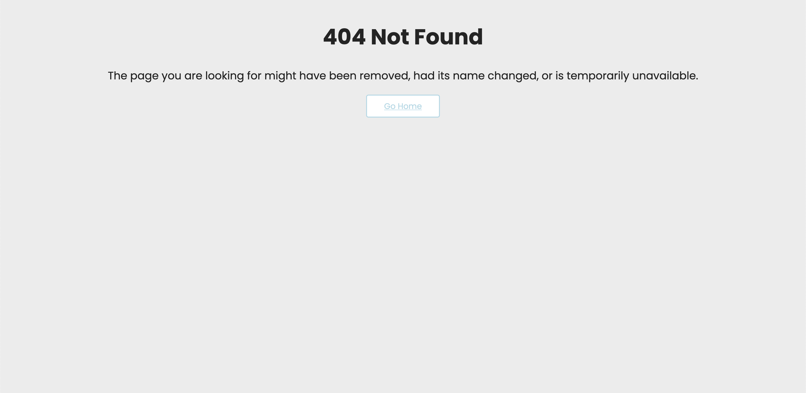

## Validation

### HTML Validation

The W3C Markup Validation Service was used to validate the HTML of the website. All pages pass with no errors.

Home

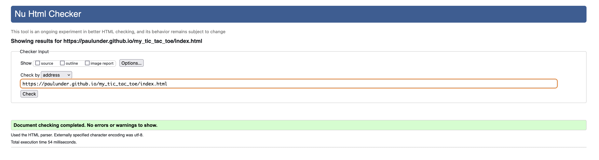

Contact form page

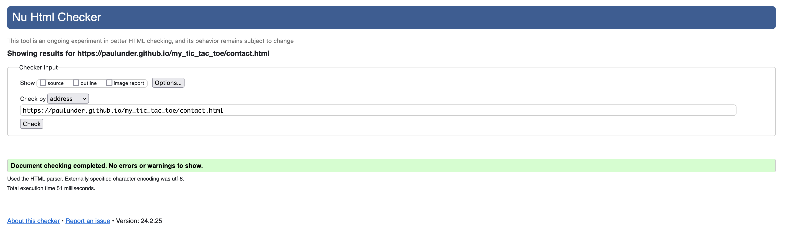

404 error page

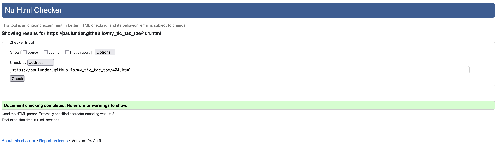

### CSS Validation

The W3C Jigsaw CSS Validation Service was used to validate the CSS of the website.
When validating all website, it passes with no errors.

All site

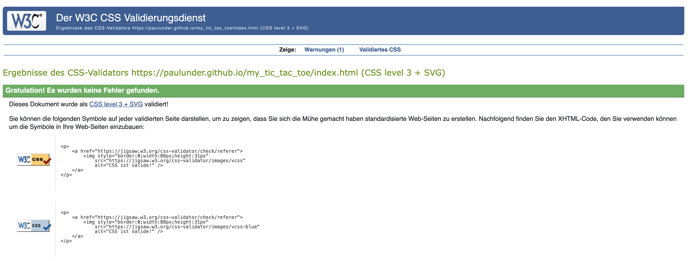

### JavaScript Validation

JSHint JS Validation Service was used to validate the Javascript files. No significant issues were found.

game.js

game-data.js

contact-form.js

### Accessibility

The WAVE WebAIM web accessibility evaluation tool was used to ensure the website met high accessibility standards.
All site pass with 0 errors.

Home page
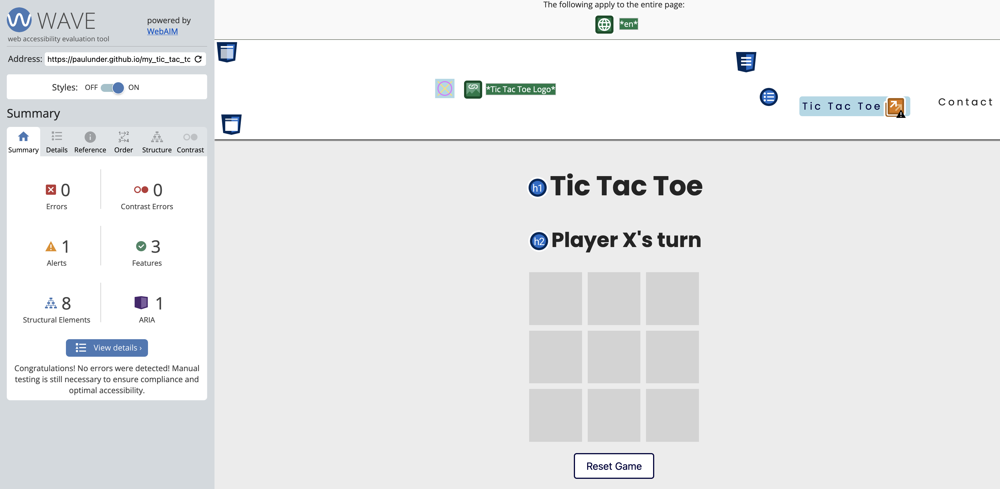

Contact form page
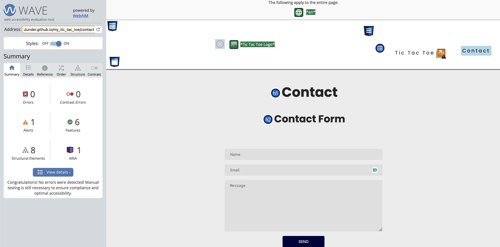

404 page
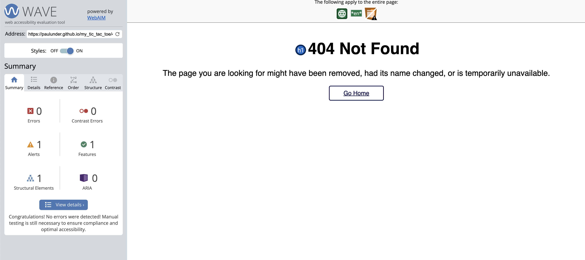

### Performance

Google Lighthouse with PageSpeed Insights was used to check the performance of the website.

Home page
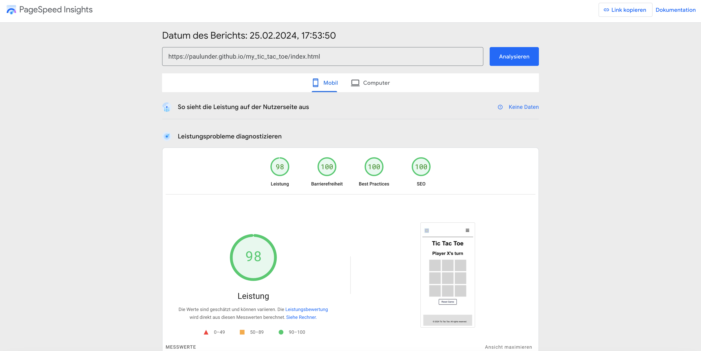

Contact form page
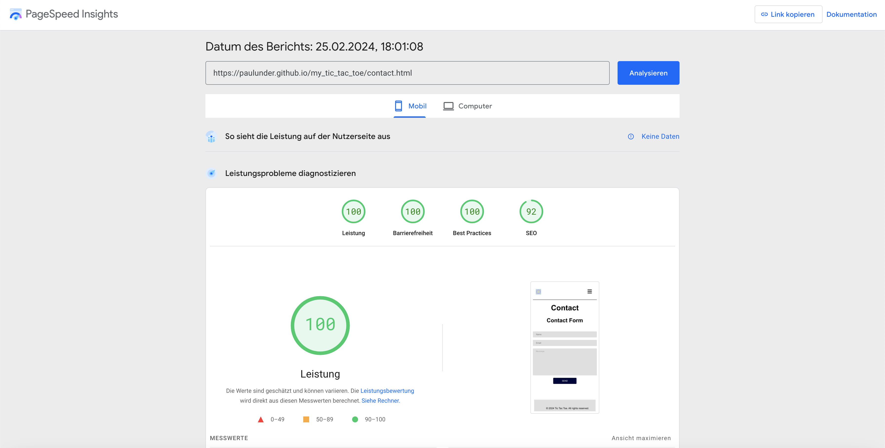

404 page
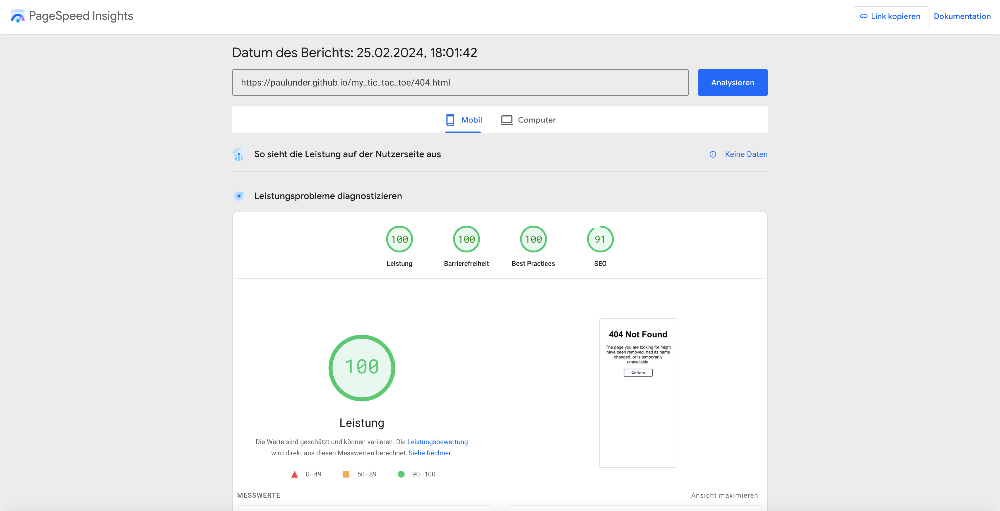

## Testing

### Performing tests on various devices

The website was tested using Google Chrome Developer Tools Toggle Device Toolbar to simulate viewports of different devices.

The website was tested on the following devices:
- MacBook Pro 2019 16" (desktop screen)
- Oneplus 8 (mobile screen)

### Browser compatibility

- Testing has been carried out on the following browsers:
  - Googe Chrome Browser
  - Firefox Browser
  - Brave Browser

### Testing user stories

1. I want to easily understand the rules of the game

| **Feature**       | **Action**        | **Expected Result**                  | **Actual Result** |
| ----------------- | ----------------- | ------------------------------------ | ----------------- |
| Intuitive Structure | Click on the boxes | Some Action happens | Works as expected |

Screenshot

2. I want to play a game with my friend

| **Feature**    | **Action**                                                           | **Expected Result**                               | **Actual Result** |
| -------------- | -------------------------------------------------------------------- | ------------------------------------------------- | ----------------- |
| PlayerRole changes | Make your turn | PlayerRole changes from X to O or from O to X | Works as expected |

Screenshot

3. I want to use the game on my mobile, tablet and desktop

| **Feature**             | **Action**                                                             | **Expected Result**                                                                                     | **Actual Result** |
| ----------------------- | ---------------------------------------------------------------------- | ------------------------------------------------------------------------------------------------------- | ----------------- |
| Responsiveness | Open the game at another device | The game should be playable on all devices | Works as expected |

Screenshot

4. I want to be able to make a win with my friend

| **Feature**                           | **Action**                               | **Expected Result**                                                       | **Actual Result** |
| ------------------------------------- | ---------------------------------------- | ------------------------------------------------------------------------- | ----------------- |
| Clarifies who has won | Play the game and see who wins | Some text should appear to clarify who has won | Works as expected |

Screenshot

5. I want to be able to see who has won

| **Feature** | **Action**                                                               | **Expected Result**                                                                        | **Actual Result** |
| ----------- | ------------------------------------------------------------------------ | ------------------------------------------------------------------------------------------ | ----------------- |
| Clarifies who has won | Play the game and see who wins | Some text should appear to clarify who has won | Works as expected |

Screenshot

6. I want to be able to see who's turn it is

| **Feature** | **Action**                                                               | **Expected Result**                                                                                              | **Actual Result** |
| ----------- | ------------------------------------------------------------------------ | ---------------------------------------------------------------------------------------------------------------- | ----------------- |
| PlayerRole changes | Make your turn | PlayerRole changes from X to O or from O to X | Works as expected |

Screenshot

7. I want to be able to see the result of the game

| **Feature**          | **Action**                                                                            | **Expected Result**                                             | **Actual Result** |
| -------------------- | ------------------------------------------------------------------------------------- | --------------------------------------------------------------- | ----------------- |
| Correct Guess Screen | Guess the hidden phrase within specific number of guesses for the game level selected | The message and number of points scored in the round displayed. | Works as expected |

Screenshot

8. I want to contact the developer if I have any questions

| **Feature**        | **Action**                                                  | **Expected Result**             | **Actual Result** |
| ------------------ | ----------------------------------------------------------- | ------------------------------- | ----------------- |
| Contact Form | Click on Contact link | The Contact form should appear | Works as expected |

Screenshot

9. I want to easily navigate throught the site

| **Feature**                                   | **Action**                | **Expected Result**                      | **Actual Result** |
| --------------------------------------------- | ------------------------- | ---------------------------------------- | ----------------- |
| 404 page | If the user has a typo | The site will redirect the User to 404 page | Works as expected |

Screenshot

